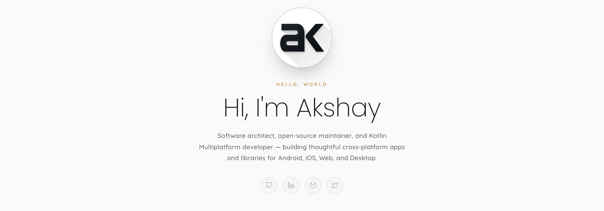

# akshay2211.github.io

Source for [ak1.io](https://ak1.io) — my personal site, blog, and project index.

<a href="https://ak1.io">
  <picture>
    <source media="(prefers-color-scheme: dark)" srcset="img/banner_dark.png">
    
  </picture>
</a>

## What's here

- **Home** — `index.html`
- **Projects** — `projects/index.html`, driven by `_data/projects.yml`
- **Blog** — Jekyll posts in `_posts/`
- **`llms.txt`** — curated entry point for language models, following [llmstxt.org](https://llmstxt.org)

## Stack

Static Jekyll site. Quicksand for body, Poppins for headings. Vanilla CSS and JS — no build step beyond `jekyll build`. Comments via [Giscus](https://giscus.app).

## Run locally

```bash
bundle install
bundle exec jekyll serve
```

Then open <http://127.0.0.1:4000>.

---

By [Akshay Sharma](https://github.com/akshay2211).
